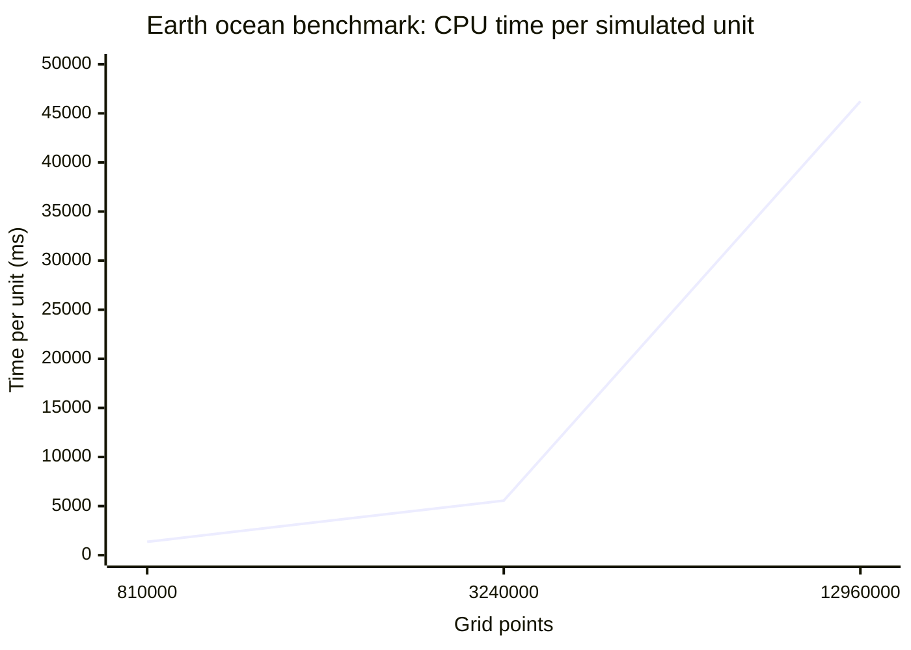

# CPU benchmark scaling

| Grid | Grid points | Time per unit (ms) |
|---|---:|---:|
| 180 × 90 × 50 | 810,000 | 1,361.65 |
| 360 × 180 × 50 | 3,240,000 | 5,560.21 |
| 720 × 360 × 50 | 12,960,000 | 46,225.24 |

The first two grids use latitude longitude geometry. The largest grid uses tripolar geometry.
