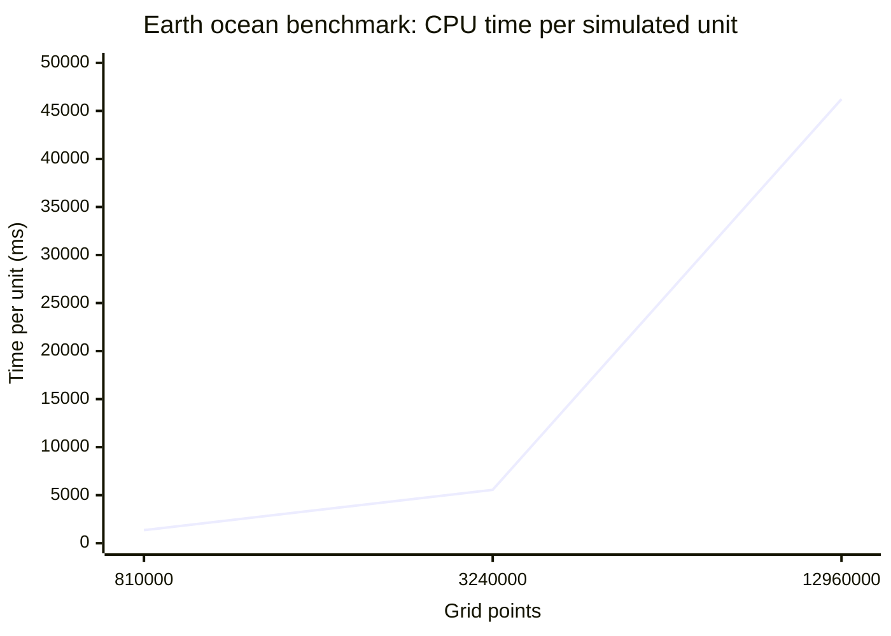
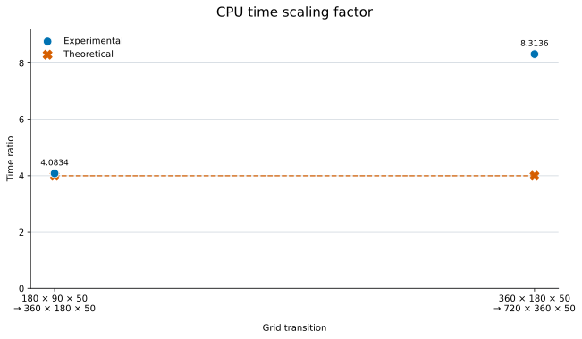

# CPU benchmark scaling

| Grid | Grid points | Time per unit (ms) |
|---|---:|---:|
| 180 × 90 × 50 | 810,000 | 1,361.65 |
| 360 × 180 × 50 | 3,240,000 | 5,560.21 |
| 720 × 360 × 50 | 12,960,000 | 46,225.24 |

The first two grids use latitude longitude geometry. The largest grid uses tripolar geometry.

## Experimental and theoretical scaling factor

The scaling factor is `larger grid time / smaller grid time`. Each transition quadruples the number of grid points, so the theoretical factor is 4. Circles show the experimental factor and crosses show the theoretical factor.

| Grid transition | Experimental factor | Theoretical factor |
|---|---:|---:|
| 180 × 90 × 50 → 360 × 180 × 50 | 4.0834 | 4.0000 |
| 360 × 180 × 50 → 720 × 360 × 50 | 8.3136 | 4.0000 |

The second transition also changes from latitude longitude geometry to tripolar geometry, so it is not a pure grid scaling comparison.
