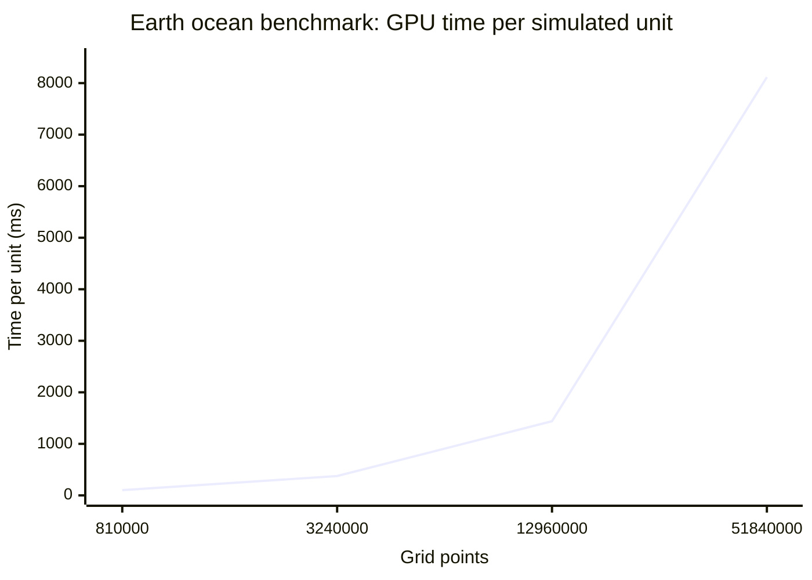
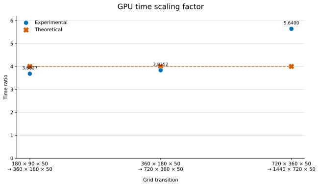

# GPU benchmark scaling

| Grid | Grid points | Time per unit (ms) |
|---|---:|---:|
| 180 × 90 × 50 | 810,000 | 101.87 |
| 360 × 180 × 50 | 3,240,000 | 375.16 |
| 720 × 360 × 50 | 12,960,000 | 1,438.83 |
| 1440 × 720 × 50 | 51,840,000 | 8,115.04 |

All GPU measurements use latitude longitude geometry.

## Experimental and theoretical scaling factor

The scaling factor is `larger grid time / smaller grid time`. Each transition quadruples the number of grid points, so the theoretical factor is 4. Circles show the experimental factor and crosses show the theoretical factor.

| Grid transition | Experimental factor | Theoretical factor |
|---|---:|---:|
| 180 × 90 × 50 → 360 × 180 × 50 | 3.6827 | 4.0000 |
| 360 × 180 × 50 → 720 × 360 × 50 | 3.8352 | 4.0000 |
| 720 × 360 × 50 → 1440 × 720 × 50 | 5.6400 | 4.0000 |
