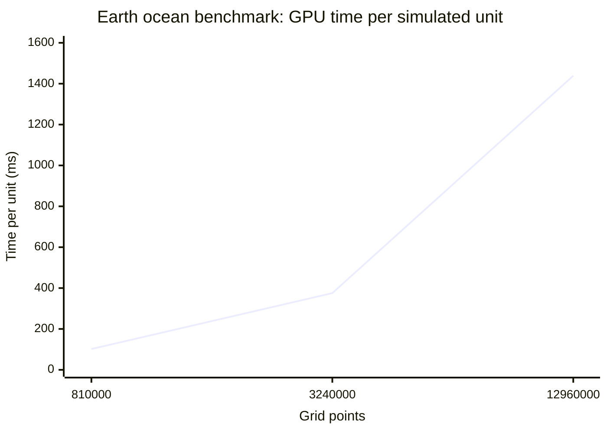

# GPU benchmark scaling

| Grid | Grid points | Time per unit (ms) |
|---|---:|---:|
| 180 × 90 × 50 | 810,000 | 101.87 |
| 360 × 180 × 50 | 3,240,000 | 375.16 |
| 720 × 360 × 50 | 12,960,000 | 1,438.83 |

All three GPU measurements use latitude longitude geometry.
