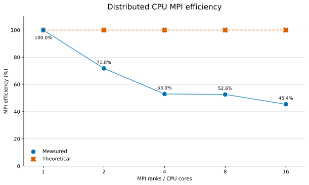

# Distributed CPU MPI efficiency

MPI efficiency is calculated as `speedup / number of cores × 100%`, where `speedup = one core time / parallel time`. The one core measurement is the baseline. Perfect linear scaling has 100% efficiency at every core count.

| CPU cores | Time per unit (ms) | Speedup | Measured efficiency | Theoretical efficiency |
|---:|---:|---:|---:|---:|
| 1 | 66,266.96 | 1.000 | 100.0% | 100.0% |
| 2 | 46,150.35 | 1.436 | 71.8% | 100.0% |
| 4 | 31,254.41 | 2.120 | 53.0% | 100.0% |
| 8 | 15,739.47 | 4.210 | 52.6% | 100.0% |
| 16 | 9,113.13 | 7.272 | 45.4% | 100.0% |

The measured time is the slowest MPI rank at each core count, which determines the elapsed time of the synchronized distributed simulation.
