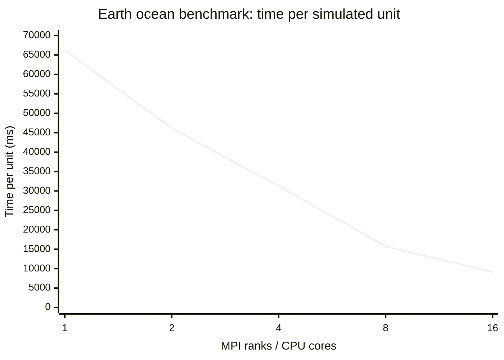
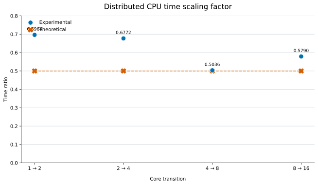

# Distributed CPU benchmark scaling

The values are the slowest rank at each core count, which determines the elapsed time of the synchronized distributed simulation.

| CPU cores | Time per unit (ms) |
|---:|---:|
| 1 | 66,266.96 |
| 2 | 46,150.35 |
| 4 | 31,254.41 |
| 8 | 15,739.47 |
| 16 | 9,113.13 |

## Experimental and theoretical scaling factor

The scaling factor is `time at 2N cores / time at N cores`. Doubling the core count theoretically halves the time, so the theoretical factor is 0.5. Circles show the experimental factor and crosses show the theoretical factor.

| Core transition | Experimental factor | Theoretical factor |
|---|---:|---:|
| 1 → 2 | 0.6964 | 0.5000 |
| 2 → 4 | 0.6772 | 0.5000 |
| 4 → 8 | 0.5036 | 0.5000 |
| 8 → 16 | 0.5790 | 0.5000 |
