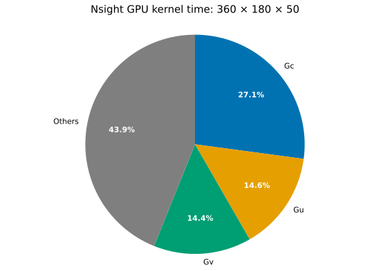

# Nsight GPU kernel time breakdown

| Component | GPU kernel time |
|---|---:|
| Gc | 27.1% |
| Gu | 14.6% |
| Gv | 14.4% |
| Others | 43.9% |

Gc, Gu, and Gv contain the total times for CUDA kernels whose names begin with `gpu_compute_hydrostatic_free_surface_Gc_`, `gpu_compute_hydrostatic_free_surface_Gu_`, and `gpu_compute_hydrostatic_free_surface_Gv_`. Others contains the remaining GPU kernel time. Values come from `kernel_summary.csv`.
