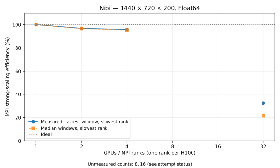

# Nibi GPU strong scaling

Global grid: 1440 × 720 × 200 (207,360,000 cells), latitude–longitude without bathymetry.
Float64, WENOVectorInvariantDefault, WENO7, CATKE, T/S, SplitRungeKutta3; Δt = 60 s.
Two warmup steps, then five windows of ten steps, matching the Rondeau reference.

| GPUs | Nodes | Partition | Fastest-window s/step | Median s/step | Speedup | MPI efficiency | Median efficiency | Spread |
|---:|---:|---|---:|---:|---:|---:|---:|---:|
| 1 | 1 | 1x1x1 | 1.021135 | 1.021461 | 1.000× | 100.0% | 100.0% | 0.3% |
| 2 | 1 | 1x2x1 | 0.527312 | 0.528632 | 1.936× | 96.8% | 96.6% | 5.8% |
| 4 | 1 | 2x2x1 | 0.266435 | 0.267753 | 3.833× | 95.8% | 95.4% | 4.7% |
| 32 | 4 | 8x4x1 | 0.098326 | 0.148059 | 10.385× | 32.5% | 21.6% | 293.4% |

MPI efficiency = T₁ / (N × Tₙ) × 100%. Tₙ is the maximum across ranks of each rank's fastest timing window, as in the reference. Median efficiency uses the maximum rank median and the one-rank median baseline. Spread = (maximum rank/window time ÷ fastest-window slowest-rank time − 1) × 100%. The suite does not retain individual windows, so these aggregates are not a synchronized per-window maximum.

Highest successful count: **32 GPUs**.

Unmeasured intermediate counts: 8, 16. No interpolation is drawn across gaps.

## Attempt status

| GPUs | Job | State | Exit code | Reason |
|---:|---|---|---|---|
| 1 | 23239281 | INVALID_RESULTS | 0:0 | Transport check passed; benchmark main() was not invoked by include guard. Fixed and rerun. |
| 2 | 23239389 | INVALID_RESULTS | 0:0 | Transport check passed; benchmark main() was not invoked by include guard. Fixed and rerun. |
| 4 | 23239390 | INVALID_RESULTS | 0:0 | Transport check passed; benchmark main() was not invoked by include guard. Fixed and rerun. |
| 8 | 23239392 | CANCELLED | 0:0 | Cancelled while pending per user instruction to finish with largest completed count. Queue reason (Priority); estimated start 2026-10-05T03:20:00 America/Toronto. |
| 16 | 23239393 | CANCELLED | 0:0 | Cancelled while pending per user instruction to finish with largest completed count. Queue reason (Priority); estimated start 2026-10-05T01:30:00 America/Toronto. |
| 32 | 23239394 | COMPLETED | 0:0 | None |
| 64 | 23239396 | CANCELLED | 0:0 | Cancelled while pending per user instruction to finish with largest completed count. Queue reason (Priority); estimated start 2026-10-05T03:10:00 America/Toronto. |
| 1 | 23239532 | COMPLETED | 0:0 | None |
| 2 | 23239533 | COMPLETED | 0:0 | None |
| 4 | 23239534 | COMPLETED | 0:0 | None |
| 128 |  | FEASIBILITY_ONLY | 0 | Slurm test accepted; estimated start 2026-10-06T21:24:21 America/Toronto. Not submitted because user requested no long queue wait. |
| 256 |  | SUBMISSION_FAILED | 1 | sbatch: error: Batch job submission failed: Requested node configuration is not available |
| 8 | 23257894 | PENDING | 0:0 | (Priority); estimated start N/A America/Toronto |
| 16 | 23257896 | PENDING | 0:0 | (Priority); estimated start N/A America/Toronto |
| 64 | 23257897 | PENDING | 0:0 | (Priority); estimated start N/A America/Toronto |
| 128 | 23257899 | PENDING | 0:0 | (Priority); estimated start N/A America/Toronto |
