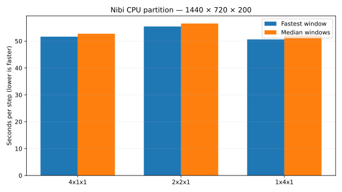

# CPU partition — super-fine grid

Fixed grid **1440 × 720 × 200**; one MPI rank per CPU node, 192 Julia threads and 192 physical cores per rank.
Float64, earth_ocean, latitude–longitude without bathymetry, WENOVectorInvariantDefault, WENO7, CATKE, T/S, SplitRungeKutta3.
Δt = 60 s; two warmup steps, then five windows of ten steps. CPU cores are bound with Slurm `--cpu-bind=cores`.

The three layouts run sequentially on the same four allocated nodes (768 cores), with fresh Julia/MPI processes for each case.

| Nodes | Cores | Partition | Job | State | Fastest s/step | Median s/step | Speedup vs 2×2×1 (fastest / median) | Details |
|---:|---:|---|---|---|---:|---:|---|---|
| 4 | 768 | 4x1x1 | 23304752 | COMPLETED | 51.668704 | 52.765599 | — | All ranks, threads, CPU affinity, and timings verified |
| 4 | 768 | 2x2x1 | 23304752 | RUNNING | — | — | — | None |
| 4 | 768 | 1x4x1 | 23304752 | WAITING | — | — | — | None |

A window is ten consecutive steps; elapsed time is divided by ten. Fastest and median window times are calculated per rank, then the maximum over ranks is reported.
Scaling efficiency = one-node time ÷ (measured time × node count). Missing or failed runs are excluded; efficiency requires a validated one-node baseline.
Submission failures, queue limits, timeouts, and benchmark failures are recorded separately from successful measurements.
