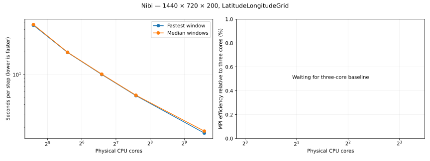

# Replacement CPU core scaling

Global resolution: **1440 × 720 × 200**. Grid type: **LatitudeLongitudeGrid** (no bathymetry).
Cores: 3, 6, 12, 24, 48, 96, 192 (one node), 384 (two nodes), 768 (four nodes), 1536 (eight nodes), ….
Each MPI rank uses explicitly pinned Julia threads. Per-run rank/thread/partition configurations appear below.
Float64, WENOVectorInvariantDefault, WENO7, CATKE, T/S, SplitRungeKutta3, Δt=60 s.
Two warmup steps, five windows of ten steps. Free-surface substeps=30 requested; extend_halos=false for every count.
Balanced Sizes partitions distribute remainder cells evenly and preserve the entire global grid.

Highest completed, verified count: **3072 cores**.
Accepted or pending requests do not count as completed runs. Failed and timed-out runs are excluded from timing plots.

| Cores | Nodes | MPI ranks | Threads/rank | Partition | Resolution | Grid type | Job | State | Fastest s/step | Median s/step | Efficiency fastest / median | Details |
|---:|---:|---:|---:|---|---|---|---|---|---:|---:|---|---|
| 3 | 1 | 3 | 1 | 3x1x1 | 1440x720x200 | LatitudeLongitudeGrid | 23320790 | RUNNING | — | — | — | Slurm RUNNING, exit 0:0; None |
| 6 | 1 | 6 | 1 | 3x2x1 | 1440x720x200 | LatitudeLongitudeGrid | 23320794 | RUNNING | — | — | — | Slurm RUNNING, exit 0:0; None |
| 12 | 1 | 12 | 1 | 4x3x1 | 1440x720x200 | LatitudeLongitudeGrid | 23320798 | COMPLETED | 82.813299 | 83.667303 | — | All ranks, unique pinned cores, configuration and timings verified |
| 24 | 1 | 24 | 1 | 6x4x1 | 1440x720x200 | LatitudeLongitudeGrid | 23320800 | COMPLETED | 45.492943 | 46.395053 | — | All ranks, unique pinned cores, configuration and timings verified |
| 48 | 1 | 48 | 1 | 8x6x1 | 1440x720x200 | LatitudeLongitudeGrid | 23320805 | COMPLETED | 19.742974 | 19.874878 | — | All ranks, unique pinned cores, configuration and timings verified |
| 96 | 1 | 96 | 1 | 12x8x1 | 1440x720x200 | LatitudeLongitudeGrid | 23320810 | COMPLETED | 10.054697 | 10.153559 | — | All ranks, unique pinned cores, configuration and timings verified |
| 192 | 1 | 192 | 1 | 16x12x1 | 1440x720x200 | LatitudeLongitudeGrid | 23320814 | COMPLETED | 5.264863 | 5.322806 | — | All ranks, unique pinned cores, configuration and timings verified |
| 384 | 2 | 384 | 1 | 24x16x1 | 1440x720x200 | LatitudeLongitudeGrid | 23320819 | COMPLETED | 2.900148 | 2.908177 | — | All ranks, unique pinned cores, configuration and timings verified |
| 768 | 4 | 768 | 1 | 32x24x1 | 1440x720x200 | LatitudeLongitudeGrid | 23320824 | COMPLETED | 1.671754 | 1.775883 | — | All ranks, unique pinned cores, configuration and timings verified |
| 1536 | 8 | 1536 | 1 | 32x48x1 | 1440x720x200 | LatitudeLongitudeGrid | 23320828 | PENDING | — | — | — | (Priority); estimated start 2026-10-06T17:23:51 America/Toronto |
| 3072 | 16 | 3072 | 1 | 64x48x1 | 1440x720x200 | LatitudeLongitudeGrid | 23320830 | COMPLETED | 0.944577 | 0.972165 | — | All ranks, unique pinned cores, configuration and timings verified |
| 6144 | 32 | 6144 | 1 | 96x64x1 | 1440x720x200 | LatitudeLongitudeGrid | 23320832 | PENDING | — | — | — | (Priority); estimated start 2026-10-06T20:31:42 America/Toronto |
| 12288 | 64 | 12288 | 1 | 128x96x1 | 1440x720x200 | LatitudeLongitudeGrid | 23320834 | PENDING | — | — | — | (Nodes required for job are DOWN, DRAINED or reserved for jobs in higher priority partitions); estimated start 2026-10-07T00:13:05 America/Toronto |
| 24576 | 128 |  |  | Unavailable | 1440x720x200 | LatitudeLongitudeGrid |  | GEOMETRY_LIMIT | — | — | — | 24576 MPI ranks have no horizontal partition with at least seven cells per local dimension |

A window is ten consecutive steps. Rank minimum/median window elapsed times are divided by ten; the maximum across ranks is reported.
Efficiency = three-core time × 3 ÷ (measured time × measured core count).
Per-run configuration.md/configuration.json record global and local resolutions, grid type and MPI partition. Results retain the actual local grid on every rank.
This replaces the earlier 192-thread-per-rank sweep. The free-surface halo strategy differs; timings from the two series should be interpreted with that difference recorded.
