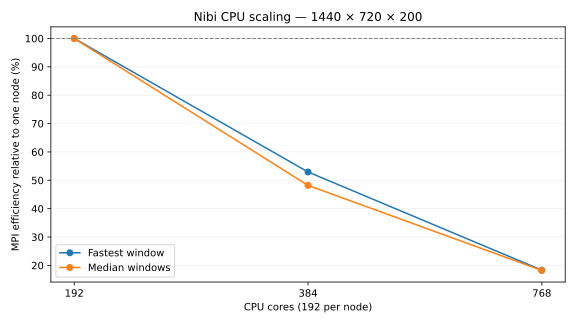

# CPU scaling — super-fine grid

Fixed grid **1440 × 720 × 200**; one MPI rank per CPU node, 192 Julia threads and 192 physical cores per rank.
Float64, earth_ocean, latitude–longitude without bathymetry, WENOVectorInvariantDefault, WENO7, CATKE, T/S, SplitRungeKutta3.
Δt = 60 s; two warmup steps, then five windows of ten steps. CPU cores are bound with Slurm `--cpu-bind=cores`.

Highest verified run: **2 CPU nodes (384 cores)**.
Only completed, validated runs count as reached; pending requests are retained.
Beyond the doubling series, 675 nodes (45×15×1) is the largest exact horizontal decomposition within the 699-node partition; 676–699 nodes have no exact horizontal decomposition.
The next power of two, 1024 nodes, exceeds this CPU partition's 699 configured nodes and cannot evenly divide the horizontal grid.
See [Slurm limit probe](run_metadata/1024_nodes_probe.txt) and [partition snapshot](run_metadata/partitions.txt).

| Nodes | Cores | Partition | Job | State | Fastest s/step | Median s/step | MPI efficiency (fastest / median) | Details |
|---:|---:|---|---|---|---:|---:|---|---|
| 1 | 192 | 1x1x1 | 23304754 | RUNNING | — | — | — | None |
| 2 | 384 | 1x2x1 | 23304755 | COMPLETED | 39.997439 | 44.307615 | — | All ranks, threads, CPU affinity, and timings verified |
| 4 | 768 | 2x2x1 | 23304756 | PENDING | — | — | — | (Priority); estimated start 2026-10-06T05:20:00 America/Toronto |
| 8 | 1536 | 4x2x1 | 23304757 | RUNNING | — | — | — | None |
| 16 | 3072 | 4x4x1 | 23304758 | PENDING | — | — | — | (Priority); estimated start 2026-10-06T04:13:53 America/Toronto |
| 32 | 6144 | 8x4x1 | 23304759 | PENDING | — | — | — | (Priority); estimated start 2026-10-06T10:38:52 America/Toronto |
| 64 | 12288 | 8x8x1 | 23304760 | PENDING | — | — | — | (Priority); estimated start 2026-10-06T21:40:00 America/Toronto |
| 128 | 24576 | 16x8x1 | 23304761 | PENDING | — | — | — | (Priority); estimated start 2026-10-06T20:30:25 America/Toronto |
| 256 | 49152 | 16x16x1 | 23304762 | PENDING | — | — | — | (Priority); estimated start 2026-10-07T10:59:48 America/Toronto |
| 512 | 98304 | 32x16x1 | 23304763 | PENDING | — | — | — | (Priority); estimated start 2026-10-13T02:51:23 America/Toronto |
| 675 | 129600 | 45x15x1 | 23304805 | PENDING | — | — | — | (Nodes required for job are DOWN, DRAINED or reserved for jobs in higher priority partitions); estimated start 2026-10-13T02:51:23 America/Toronto |

A window is ten consecutive steps; elapsed time is divided by ten. Fastest and median window times are calculated per rank, then the maximum over ranks is reported.
Scaling efficiency = one-node time ÷ (measured time × node count). Missing or failed runs are excluded; efficiency requires a validated one-node baseline.
Submission failures, queue limits, timeouts, and benchmark failures are recorded separately from successful measurements.
