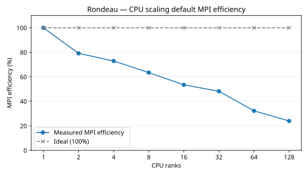

# Rondeau CPU scaling default

Timings use the slowest MPI rank at each count. Global grid: 360 × 180 × 50, tripolar with partial-cell bathymetry. At 64 and 128 ranks the last partitions receive the leftover cells, so local grid sizes vary by rank. The 128-rank partition is 8 × 16 × 1 to keep x evenly divided across the tripolar fold.
These timing runs use Float64, 60 simulated seconds per step, 2 warmup steps, and 5 samples of 10 steps.

| CPU ranks | Seconds per step | Steps per second | Speedup | MPI efficiency | Ideal efficiency |
|---:|---:|---:|---:|---:|---:|
| 1 | 25.226968 | 0.039640 | 1.000× | 100.0% | 100.0% |
| 2 | 15.939943 | 0.062735 | 1.583× | 79.1% | 100.0% |
| 4 | 8.648960 | 0.115621 | 2.917× | 72.9% | 100.0% |
| 8 | 4.970663 | 0.201180 | 5.075× | 63.4% | 100.0% |
| 16 | 2.949576 | 0.339032 | 8.553× | 53.5% | 100.0% |
| 32 | 1.635220 | 0.611539 | 15.427× | 48.2% | 100.0% |
| 64 | 1.222766 | 0.817818 | 20.631× | 32.2% | 100.0% |
| 128 | 0.822501 | 1.215805 | 30.671× | 24.0% | 100.0% |

MPI efficiency = (one-rank step time ÷ current step time) ÷ rank count × 100%. The one-rank measurement is the baseline. The table uses the slowest MPI rank at each count.
