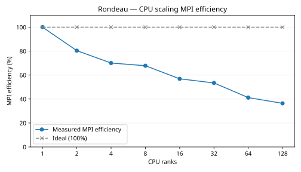

# Rondeau CPU scaling fine

Timings use the slowest MPI rank at each count. Global grid: 720 × 360 × 50, tripolar with partial-cell bathymetry.
These timing runs use Float64, 60 simulated seconds per step, 2 warmup steps, and 5 samples of 10 steps.

| CPU ranks | Seconds per step | Steps per second | Speedup | MPI efficiency | Ideal efficiency |
|---:|---:|---:|---:|---:|---:|
| 1 | 99.772836 | 0.010023 | 1.000× | 100.0% | 100.0% |
| 2 | 62.044896 | 0.016117 | 1.608× | 80.4% | 100.0% |
| 4 | 35.604443 | 0.028086 | 2.802× | 70.1% | 100.0% |
| 8 | 18.389982 | 0.054377 | 5.425× | 67.8% | 100.0% |
| 16 | 10.964632 | 0.091202 | 9.100× | 56.9% | 100.0% |
| 32 | 5.835605 | 0.171362 | 17.097× | 53.4% | 100.0% |
| 64 | 3.783972 | 0.264273 | 26.367× | 41.2% | 100.0% |
| 128 | 2.141795 | 0.466898 | 46.584× | 36.4% | 100.0% |

MPI efficiency = (one-rank step time ÷ current step time) ÷ rank count × 100%. The one-rank measurement is the baseline. The table uses the slowest MPI rank at each count.
