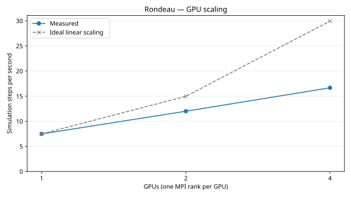

# Rondeau GPU scaling

Timings use the slowest MPI rank at each count.

Speed means simulation steps per second (the reciprocal of step time). Each step advances 60 simulated seconds. These timing runs use Float64, 2 warmup steps, and 5 samples of 10 steps.

Efficiency = one-rank time / parallel time / rank count × 100%.

| Count | Seconds per step | Steps per second | Speedup | Efficiency |
|---:|---:|---:|---:|---:|
| 1 | 0.133612 | 7.484343 | 1.000× | 100.0% |
| 2 | 0.083338 | 11.999351 | 1.603× | 80.2% |
| 4 | 0.060002 | 16.666225 | 2.227× | 55.7% |
