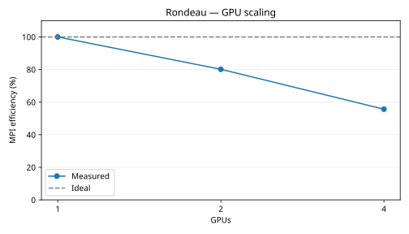

# Rondeau GPU scaling

Timings use the slowest MPI rank at each count.
These timing runs use Float64, 60 simulated seconds per step, 2 warmup steps, and 5 samples of 10 steps.

| GPUs | Seconds per step | Steps per second | Speedup | MPI efficiency | Ideal efficiency |
|---:|---:|---:|---:|---:|---:|
| 1 | 0.133612 | 7.484343 | 1.000× | 100.0% | 100.0% |
| 2 | 0.083338 | 11.999351 | 1.603× | 80.2% | 100.0% |
| 4 | 0.060002 | 16.666225 | 2.227× | 55.7% | 100.0% |

MPI efficiency = (one-rank step time ÷ current step time) ÷ rank count × 100%. The one-rank measurement is the baseline. The table uses the slowest MPI rank at each count.
