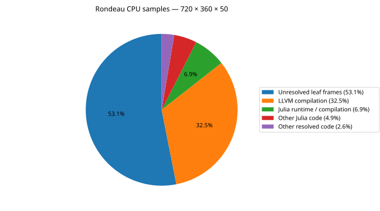

# Rondeau CPU samples — 720 × 360 × 50

Exclusive leaf-frame counts from Nsight Systems CPU sampling (`COMPOSITE_EVENTS` joined to `SAMPLING_CALLCHAINS` at stack depth 0). All captured process-tree threads are included. Each sample is counted once, without summing ancestor frames. This capture includes compilation, startup, 2 warmup steps and 2 measured steps, so it is not a pure timestep breakdown. Unlike GPU pies, percentages describe CPU samples rather than kernel duration. See `cpu_sample_summary.csv` for symbols and categories.

| Category | CPU samples | Share |
|---|---:|---:|
| Unresolved leaf frames | 1,309,480 | 53.10% |
| LLVM compilation | 801,192 | 32.49% |
| Julia runtime / compilation | 169,725 | 6.88% |
| Other Julia code | 120,428 | 4.88% |
| Other resolved code | 65,259 | 2.65% |
