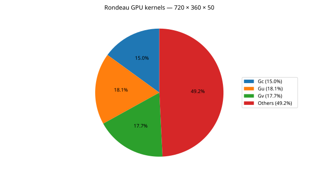

# Rondeau GPU kernels — 720 × 360 × 50

Matches the Andi 5070 Ti grouping: hydrostatic free surface Gc, Gu, Gv kernels and all remaining kernels. Shares use summed GPU kernel duration from `kernel_summary_cuda_gpu_kern_sum.csv`, not elapsed wall time. The capture includes startup, warmup and measured steps; concurrent kernel durations can overlap.

| Category | Kernel duration (ns) | Share |
|---|---:|---:|
| Gc | 97,432,779 | 14.99% |
| Gu | 117,456,935 | 18.07% |
| Gv | 115,360,793 | 17.74% |
| Others | 319,934,172 | 49.21% |
