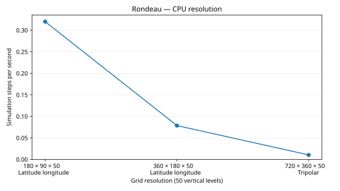
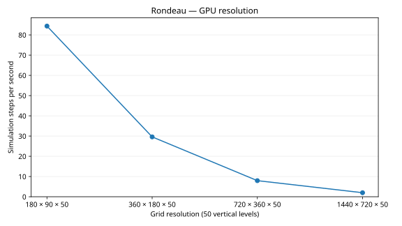
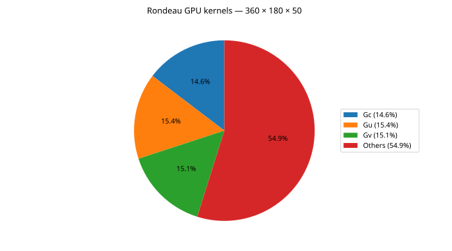

# Rondeau benchmark plots

Charts follow the Andi 5070 Ti reference grouping and scaling definitions.

| Series | Report | Speed | Scaling |
|---|---|---|---|
| cpu resolution | [Report](cpu_resolution/plot.md) | [Chart](cpu_resolution/speed.svg) | [Chart](cpu_resolution/scaling_factor_scatter.svg) |
| gpu resolution | [Report](gpu_resolution/plot.md) | [Chart](gpu_resolution/speed.svg) | [Chart](gpu_resolution/scaling_factor_scatter.svg) |
| cpu scaling | [Report](cpu_scaling/plot.md) | [Chart](cpu_scaling/speed.svg) | [Chart](cpu_scaling/mpi_efficiency.svg) |
| gpu scaling | [Report](gpu_scaling/plot.md) | [Chart](gpu_scaling/speed.svg) | [Chart](gpu_scaling/mpi_efficiency.svg) |

Profiles: [GPU 360](nsys_gpu/360x180x50/plot.md), [GPU 720](nsys_gpu/720x360x50/plot.md), [CPU 720](nsys_cpu/720x360x50/plot.md).

## CPU resolution

## GPU resolution

## CPU scaling

## GPU scaling

## Nsight profiles

GPU pies show summed kernel duration; the CPU pie shows exclusive leaf-frame sample counts. Captures include compilation, startup, warmup and measured steps. See individual reports for definitions and source data.

