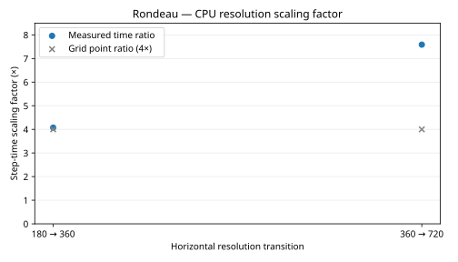
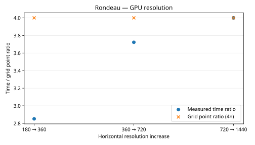
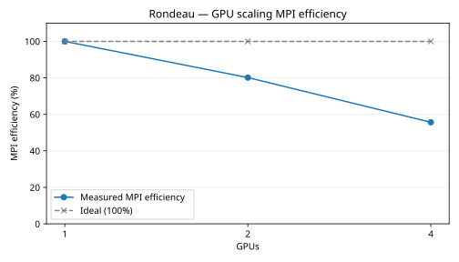
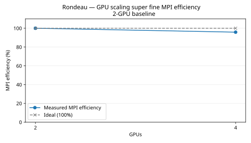

# Rondeau benchmark plots

## Benchmark configuration

All timing cases call `earth_ocean` through `benchmarking/run_benchmarks.jl`. Grid dimensions below are global; MPI partitions split the horizontal grid across ranks.

| Series | Global resolution | `grid_type` passed to `earth_ocean` | Grid constructed | MPI ranks |
|---|---|---|---|---|
| CPU resolution | 180 × 90 × 50; 360 × 180 × 50 | `lat_lon` | Plain `LatitudeLongitudeGrid`, no bathymetry | 1 |
| CPU resolution | 720 × 360 × 50 | `tripolar` | `TripolarGrid` with immersed partial-cell bathymetry | 1 |
| GPU resolution | 180 × 90 × 50; 360 × 180 × 50; 720 × 360 × 50; 1440 × 720 × 50 | `lat_lon` | Plain `LatitudeLongitudeGrid`, no bathymetry | 1 |
| CPU scaling default | 360 × 180 × 50 | `tripolar` | `TripolarGrid` with immersed partial-cell bathymetry | 1, 2, 4, 8, 16, 32, 64, 128 |
| CPU scaling fine | 720 × 360 × 50 | `tripolar` | `TripolarGrid` with immersed partial-cell bathymetry | 1, 2, 4, 8, 16, 32, 64, 128 |
| GPU scaling fine | 720 × 360 × 50 | `tripolar` | `TripolarGrid` with immersed partial-cell bathymetry | 1, 2, 4 |
| GPU scaling super fine | 1440 × 720 × 200 | `lat_lon` | Plain `LatitudeLongitudeGrid`, no bathymetry | 2, 4 |

All timing runs pass `float_type=Float64`, `zstar_coordinate=false`, `momentum_advection=WENOVectorInvariantDefault`, `tracer_advection=WENO7`, `closure=CATKE`, `timestepper=SplitRungeKutta3`, and `tracers=T,S` to the runner. The runner passes the corresponding objects and the listed dimensions and grid type to `earth_ocean`. Timing uses `dt=60` simulated seconds, 2 warmup steps, and 5 samples of 10 steps; each CPU rank has one Julia thread. `earth_ocean` uses a 7-cell halo, exponentially spaced vertical levels over 5000 m, a split explicit free surface with 30 substeps, TEOS-10 seawater buoyancy, and spherical Coriolis. The latitude longitude domain spans 0–360° longitude and −80–85° latitude. These are model settings, not extra command-line arguments.

The 1440 GPU scaling run uses `lat_lon` because the benchmark bathymetry dataset has no 1440 × 720 tripolar file. Its timings therefore differ in both resolution and grid type from GPU scaling fine; compare MPI efficiency within each series.

Resolution points show the ratio of adjacent step times. MPI efficiency uses the one-rank step time as its baseline, as in the Andi 5070 Ti reference. The data table directly follows each chart.

## CPU resolution

| Resolution transition | From time (s/step) | To time (s/step) | Measured scaling factor | Grid point ratio |
|---|---:|---:|---:|---:|
| 180 → 360 | 3.126001 | 12.734940 | 4.074× | 4.000× |
| 360 → 720 | 12.734940 | 96.617069 | 7.587× | 4.000× |

The 360 → 720 CPU comparison also changes the grid from latitude longitude to tripolar geometry.

[Method and source data](cpu_resolution/plot.md)

## GPU resolution

| Resolution transition | From time (s/step) | To time (s/step) | Measured scaling factor | Grid point ratio |
|---|---:|---:|---:|---:|
| 180 → 360 | 0.011853 | 0.033800 | 2.852× | 4.000× |
| 360 → 720 | 0.033800 | 0.125816 | 3.722× | 4.000× |
| 720 → 1440 | 0.125816 | 0.503266 | 4.000× | 4.000× |

[Method and source data](gpu_resolution/plot.md)

## CPU scaling default

| CPU ranks | Seconds per step | Steps per second | Speedup | MPI efficiency | Ideal efficiency |
|---:|---:|---:|---:|---:|---:|
| 1 | 25.226968 | 0.039640 | 1.000× | 100.0% | 100.0% |
| 2 | 15.939943 | 0.062735 | 1.583× | 79.1% | 100.0% |
| 4 | 8.648960 | 0.115621 | 2.917× | 72.9% | 100.0% |
| 8 | 4.970663 | 0.201180 | 5.075× | 63.4% | 100.0% |
| 16 | 2.949576 | 0.339032 | 8.553× | 53.5% | 100.0% |
| 32 | 1.635220 | 0.611539 | 15.427× | 48.2% | 100.0% |
| 64 | 1.222766 | 0.817818 | 20.631× | 32.2% | 100.0% |
| 128 | 0.822501 | 1.215805 | 30.671× | 24.0% | 100.0% |

At 64 and 128 CPU ranks the 360 × 180 horizontal grid does not divide evenly; the last partitions receive the leftover cells, and the chart uses the slowest rank. The 128-rank partition is 8 × 16 × 1 to keep x evenly divided across the tripolar fold.

[Method and source data](cpu_scaling_default/plot.md)

## CPU scaling fine

| CPU ranks | Seconds per step | Steps per second | Speedup | MPI efficiency | Ideal efficiency |
|---:|---:|---:|---:|---:|---:|
| 1 | 99.772836 | 0.010023 | 1.000× | 100.0% | 100.0% |
| 2 | 62.044896 | 0.016117 | 1.608× | 80.4% | 100.0% |
| 4 | 35.604443 | 0.028086 | 2.802× | 70.1% | 100.0% |
| 8 | 18.389982 | 0.054377 | 5.425× | 67.8% | 100.0% |
| 16 | 10.964632 | 0.091202 | 9.100× | 56.9% | 100.0% |
| 32 | 5.835605 | 0.171362 | 17.097× | 53.4% | 100.0% |
| 64 | 3.783972 | 0.264273 | 26.367× | 41.2% | 100.0% |
| 128 | 2.141795 | 0.466898 | 46.584× | 36.4% | 100.0% |

[Method and source data](cpu_scaling_fine/plot.md)

## GPU scaling fine

| GPUs | Seconds per step | Steps per second | Speedup | MPI efficiency | Ideal efficiency |
|---:|---:|---:|---:|---:|---:|
| 1 | 0.133612 | 7.484343 | 1.000× | 100.0% | 100.0% |
| 2 | 0.083338 | 11.999351 | 1.603× | 80.2% | 100.0% |
| 4 | 0.060002 | 16.666225 | 2.227× | 55.7% | 100.0% |

[Method and source data](gpu_scaling_fine/plot.md)

## GPU scaling super fine

| GPUs | Seconds per step | Steps per second | Speedup vs 2 GPUs | MPI efficiency | Ideal efficiency |
|---:|---:|---:|---:|---:|---:|
| 2 | 0.991023 | 1.009058 | 1.000× | 100.0% | 100.0% |
| 4 | 0.517122 | 1.933778 | 1.916× | 95.8% | 100.0% |

The one-GPU case exceeded available GPU memory before warmup. MPI efficiency is normalized to the two-GPU baseline: (two-GPU step time ÷ current step time) × 2 ÷ GPU count × 100%. See [rerun provenance](gpu_scaling_super_fine/rerun.md).

[Method and source data](gpu_scaling_super_fine/plot.md)

## Nsight profiles

These profiling cases use `tripolar` grids with immersed partial-cell bathymetry and the same model parameters above, but use 2 warmup steps and 1 sample of 2 steps.

GPU pies use summed kernel durations; the CPU pie uses exclusive leaf-frame sample counts. The captures include startup, compilation, warmup and measured steps.

### GPU 360 × 180 × 50

| Category | Kernel duration (ns) | Share |
|---|---:|---:|
| Gc | 26,755,487 | 14.65% |
| Gu | 28,111,060 | 15.39% |
| Gv | 27,590,682 | 15.10% |
| Others | 100,213,857 | 54.86% |

[Method and source data](nsys_gpu/360x180x50/plot.md)

### GPU 720 × 360 × 50

| Category | Kernel duration (ns) | Share |
|---|---:|---:|
| Gc | 97,432,779 | 14.99% |
| Gu | 117,456,935 | 18.07% |
| Gv | 115,360,793 | 17.74% |
| Others | 319,934,172 | 49.21% |

[Method and source data](nsys_gpu/720x360x50/plot.md)

### CPU 720 × 360 × 50

| Category | CPU samples | Share |
|---|---:|---:|
| Unresolved leaf frames | 1,309,480 | 53.10% |
| LLVM compilation | 801,192 | 32.49% |
| Julia runtime / compilation | 169,725 | 6.88% |
| Other Julia code | 120,428 | 4.88% |
| Other resolved code | 65,259 | 2.65% |

[Method and source data](nsys_cpu/720x360x50/plot.md)
