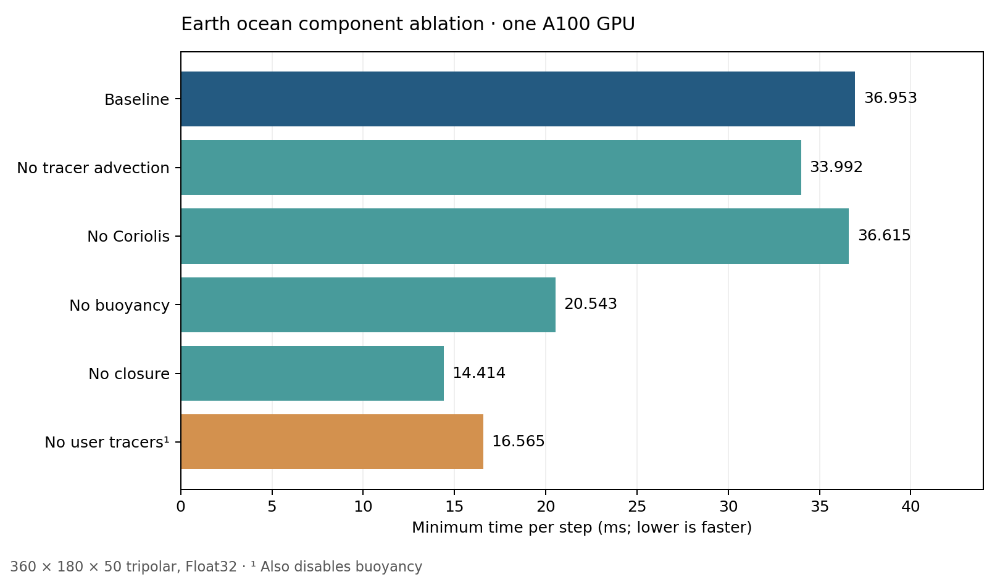

# Earth ocean component ablation, one GPU

Six sequential `earth_ocean` timing runs on GPU 0 at `360×180×50`, tripolar grid, and `Float32`. The baseline uses `WENOVectorInvariant()`, `WENO(order=7)` tracer advection, spherical Coriolis, TEOS10 seawater buoyancy, CATKE, `SplitExplicitFreeSurface(substeps=30)`, `SplitRungeKutta3`, and user tracers `T,S`.

Each result is the minimum time per step across five windows of ten steps, after two warmup steps, with `Δt=60 s`. Each case has its own JSON and Markdown report.



| Case | Changed setting | Minimum ms/step |
|---|---|---:|
| [Baseline](baseline/results.md) | None | 36.953 |
| [No tracer advection](no_tracer_advection/results.md) | `tracer_advection=nothing` | 33.992 |
| [No Coriolis](no_coriolis/results.md) | `coriolis=nothing` | 36.615 |
| [No buoyancy](no_buoyancy/results.md) | `buoyancy=nothing` | 20.543 |
| [No closure](no_closure/results.md) | `closure=nothing` | 14.414 |
| [No user tracers](no_tracers/results.md) | `tracers=()` and `buoyancy=nothing` | 16.565 |

The no-user-tracers case retains CATKE, which automatically adds its required TKE tracer `e`. Buoyancy is also disabled because the default seawater formulation requires `T` and `S`.

Run the series from the repository root with:

```bash
bash benchmarking/results/rondeau/run_component_ablation.sh
```

Set `GPU_ID` to select the single visible GPU. `RUN_ROOT` and case names can be supplied to resume selected cases in an existing result directory.

Regenerate the chart from the saved JSON results with `python3 benchmarking/results/rondeau/2026-09-30T034053Z_component_ablation_671689/plot.py`.
