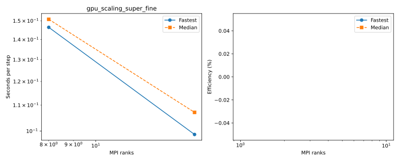
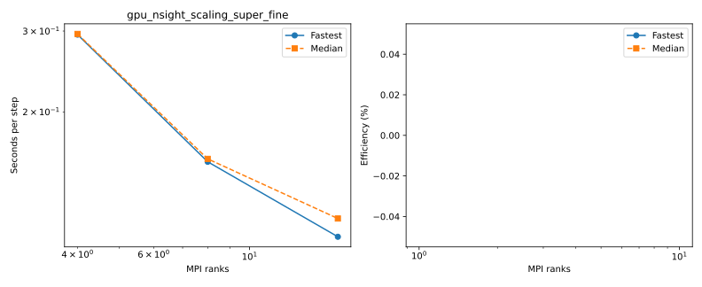
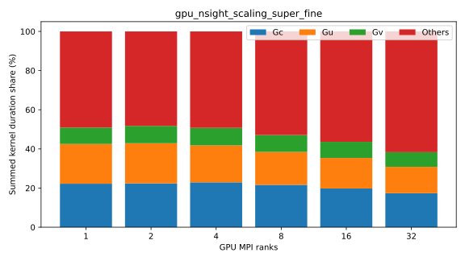

# Full benchmark suite

LatitudeLongitudeGrid without bathymetry; Float64, WENOVectorInvariantDefault, WENO7, CATKE, T/S, SplitRungeKutta3.
Δt=60 s; 30 requested free-surface substeps; two untimed steps and five ten-step windows.
One MPI rank per CPU core or GPU, one Julia computation thread per rank. CPU extended halos=false; GPU=true.
Window boundaries synchronize MPI ranks and GPUs. Fastest/median statistics use the maximum across ranks.
Efficiency uses the measured one-rank baseline for each scaling series. Missing baselines have no efficiency estimate.
Profiled timings are separate; Nsight captures CUDA/NVTX/MPI after warmup. Kernel shares sum durations across ranks, not elapsed wall time.

## cpu_mpi_scaling_super_fine

Highest completed count: **0 ranks**.

| Case | Ranks | Partition | Global resolution | Grid type | State | Fastest s/step | Median s/step | Efficiency fastest / median | Details |
|---|---:|---|---|---|---|---:|---:|---|---|
| 1_ranks | 1 | 1x1x1 | 1440x720x200 | LatitudeLongitudeGrid | FAILED | — | — | — | Exit 9:0; None |
| 3_ranks | 3 | 3x1x1 | 1440x720x200 | LatitudeLongitudeGrid | FAILED | — | — | — | Exit 9:0; None |
| 6_ranks | 6 | 3x2x1 | 1440x720x200 | LatitudeLongitudeGrid | FAILED | — | — | — | Exit 9:0; None |
| 12_ranks | 12 | 4x3x1 | 1440x720x200 | LatitudeLongitudeGrid | FAILED | — | — | — | Exit 9:0; None |
| 24_ranks | 24 | 6x4x1 | 1440x720x200 | LatitudeLongitudeGrid | FAILED | — | — | — | Exit 9:0; None |
| 48_ranks | 48 | 8x6x1 | 1440x720x200 | LatitudeLongitudeGrid | FAILED | — | — | — | Exit 9:0; None |
| 96_ranks | 96 | 12x8x1 | 1440x720x200 | LatitudeLongitudeGrid | FAILED | — | — | — | Exit 9:0; None |
| 192_ranks | 192 | 16x12x1 | 1440x720x200 | LatitudeLongitudeGrid | FAILED | — | — | — | Exit 9:0; None |
| 384_ranks | 384 | 24x16x1 | 1440x720x200 | LatitudeLongitudeGrid | FAILED | — | — | — | Exit 9:0; None |
| 768_ranks | 768 | 32x24x1 | 1440x720x200 | LatitudeLongitudeGrid | FAILED | — | — | — | Exit 9:0; None |
| 1536_ranks | 1536 | 32x48x1 | 1440x720x200 | LatitudeLongitudeGrid | FAILED | — | — | — | Exit 9:0; None |
| 3072_ranks | 3072 | 64x48x1 | 1440x720x200 | LatitudeLongitudeGrid | FAILED | — | — | — | Exit 9:0; None |
| 6144_ranks | 6144 | 96x64x1 | 1440x720x200 | LatitudeLongitudeGrid | PENDING | — | — | — | (Priority); estimated start 2026-10-07T04:57:56 (scheduler timezone) |
| 12288_ranks | 12288 | 128x96x1 | 1440x720x200 | LatitudeLongitudeGrid | PENDING | — | — | — | (Nodes required for job are DOWN, DRAINED or reserved for jobs in higher priority partitions); estimated start 2026-10-07T04:50:32 (scheduler timezone) |
| 24576_ranks | 24576 |  | 1440x720x200 | LatitudeLongitudeGrid | GEOMETRY_LIMIT | — | — | — | 24576 ranks have no horizontal partition with at least 7 local cells per direction |
## gpu_scaling_super_fine

Highest completed count: **16 ranks**.

| Case | Ranks | Partition | Global resolution | Grid type | State | Fastest s/step | Median s/step | Efficiency fastest / median | Details |
|---|---:|---|---|---|---|---:|---:|---|---|
| 1_ranks | 1 | 1x1x1 | 1440x720x200 | LatitudeLongitudeGrid | PENDING | — | — | — | (ReqNodeNotAvail, UnavailableNodes:rg[12602,12903,13403]); estimated start N/A (scheduler timezone) |
| 2_ranks | 2 | 2x1x1 | 1440x720x200 | LatitudeLongitudeGrid | PENDING | — | — | — | (ReqNodeNotAvail, UnavailableNodes:rg[12602,12903,13403]); estimated start N/A (scheduler timezone) |
| 4_ranks | 4 | 2x2x1 | 1440x720x200 | LatitudeLongitudeGrid | RUNNING | — | — | — | Exit 0:0; None |
| 8_ranks | 8 | 4x2x1 | 1440x720x200 | LatitudeLongitudeGrid | COMPLETED | 0.146426 | 0.150829 | — | Rank results, finite fields and resource placement verified |
| 16_ranks | 16 | 4x4x1 | 1440x720x200 | LatitudeLongitudeGrid | COMPLETED | 0.098755 | 0.107124 | — | Rank results, finite fields and resource placement verified |
| 32_ranks | 32 | 8x4x1 | 1440x720x200 | LatitudeLongitudeGrid | PENDING | — | — | — | (Priority); estimated start 2026-10-07T09:10:00 (scheduler timezone) |
| 64_ranks | 64 | 8x8x1 | 1440x720x200 | LatitudeLongitudeGrid | PENDING | — | — | — | (Priority); estimated start 2026-10-07T07:29:31 (scheduler timezone) |
| 128_ranks | 128 | 16x8x1 | 1440x720x200 | LatitudeLongitudeGrid | PENDING | — | — | — | (Nodes required for job are DOWN, DRAINED or reserved for jobs in higher priority partitions); estimated start 2026-10-07T20:12:06 (scheduler timezone) |
| 256_ranks | 256 | 16x16x1 | 1440x720x200 | LatitudeLongitudeGrid | PENDING | — | — | — | (Resources); estimated start 2026-10-10T10:21:58 (scheduler timezone) |
| 512_ranks | 512 | 32x16x1 | 1440x720x200 | LatitudeLongitudeGrid | RESOURCE_LIMIT | — | — | — | Requires 512; configured capacity is 264 |

[8_ranks configuration](gpu_scaling_super_fine/8_ranks/configuration.md): local resolution **360–360 × 360–360 × 200**, retained free-surface substeps [21].

[16_ranks configuration](gpu_scaling_super_fine/16_ranks/configuration.md): local resolution **360–360 × 180–180 × 200**, retained free-surface substeps [21].
## cpu_resolution

Highest completed count: **0 ranks**.

| Case | Ranks | Partition | Global resolution | Grid type | State | Fastest s/step | Median s/step | Efficiency fastest / median | Details |
|---|---:|---|---|---|---|---:|---:|---|---|
| default | 1 | 1x1x1 | 360x180x50 | LatitudeLongitudeGrid | FAILED | — | — | — | Exit 9:0; None |
| fine | 1 | 1x1x1 | 720x360x100 | LatitudeLongitudeGrid | FAILED | — | — | — | Exit 9:0; None |
| super_fine | 1 | 1x1x1 | 1440x720x200 | LatitudeLongitudeGrid | FAILED | — | — | — | Exit 9:0; None |
## gpu_resolution

Highest completed count: **0 ranks**.

| Case | Ranks | Partition | Global resolution | Grid type | State | Fastest s/step | Median s/step | Efficiency fastest / median | Details |
|---|---:|---|---|---|---|---:|---:|---|---|
| default | 1 | 1x1x1 | 360x180x50 | LatitudeLongitudeGrid | PENDING | — | — | — | (ReqNodeNotAvail, UnavailableNodes:rg[12602,12903,13403]); estimated start N/A (scheduler timezone) |
| fine | 1 | 1x1x1 | 720x360x100 | LatitudeLongitudeGrid | PENDING | — | — | — | (ReqNodeNotAvail, UnavailableNodes:rg[12602,12903,13403]); estimated start N/A (scheduler timezone) |
| super_fine | 1 | 1x1x1 | 1440x720x200 | LatitudeLongitudeGrid | PENDING | — | — | — | (ReqNodeNotAvail, UnavailableNodes:rg[12602,12903,13403]); estimated start N/A (scheduler timezone) |
## cpu_partition_cores_super_fine

Highest completed count: **0 ranks**.

| Case | Ranks | Partition | Global resolution | Grid type | State | Fastest s/step | Median s/step | Efficiency fastest / median | Details |
|---|---:|---|---|---|---|---:|---:|---|---|
| 192x1x1 | 192 | 192x1x1 | 1440x720x200 | LatitudeLongitudeGrid | FAILED | — | — | — | Exit 9:0; None |
| 96x2x1 | 192 | 96x2x1 | 1440x720x200 | LatitudeLongitudeGrid | FAILED | — | — | — | Exit 9:0; None |
| 64x3x1 | 192 | 64x3x1 | 1440x720x200 | LatitudeLongitudeGrid | FAILED | — | — | — | Exit 9:0; None |
| 48x4x1 | 192 | 48x4x1 | 1440x720x200 | LatitudeLongitudeGrid | FAILED | — | — | — | Exit 9:0; None |
| 32x6x1 | 192 | 32x6x1 | 1440x720x200 | LatitudeLongitudeGrid | FAILED | — | — | — | Exit 9:0; None |
| 24x8x1 | 192 | 24x8x1 | 1440x720x200 | LatitudeLongitudeGrid | FAILED | — | — | — | Exit 9:0; None |
| 16x12x1 | 192 | 16x12x1 | 1440x720x200 | LatitudeLongitudeGrid | FAILED | — | — | — | Exit 9:0; None |
| 12x16x1 | 192 | 12x16x1 | 1440x720x200 | LatitudeLongitudeGrid | FAILED | — | — | — | Exit 9:0; None |
| 8x24x1 | 192 | 8x24x1 | 1440x720x200 | LatitudeLongitudeGrid | FAILED | — | — | — | Exit 9:0; None |
| 6x32x1 | 192 | 6x32x1 | 1440x720x200 | LatitudeLongitudeGrid | FAILED | — | — | — | Exit 9:0; None |
| 4x48x1 | 192 | 4x48x1 | 1440x720x200 | LatitudeLongitudeGrid | FAILED | — | — | — | Exit 9:0; None |
| 3x64x1 | 192 | 3x64x1 | 1440x720x200 | LatitudeLongitudeGrid | FAILED | — | — | — | Exit 9:0; None |
| 2x96x1 | 192 | 2x96x1 | 1440x720x200 | LatitudeLongitudeGrid | FAILED | — | — | — | Exit 9:0; None |
| 1x192x1 | 192 | 1x192x1 | 1440x720x200 | LatitudeLongitudeGrid | GEOMETRY_LIMIT | — | — | — | Partition [1, 192, 1] has fewer than 7 local cells per horizontal direction |
## gpu_nsight_scaling_super_fine

Highest completed count: **16 ranks**.

| Case | Ranks | Partition | Global resolution | Grid type | State | Fastest s/step | Median s/step | Efficiency fastest / median | Details |
|---|---:|---|---|---|---|---:|---:|---|---|
| 1_ranks | 1 | 1x1x1 | 1440x720x200 | LatitudeLongitudeGrid | PENDING | — | — | — | (ReqNodeNotAvail, UnavailableNodes:rg[12602,12903,13403]); estimated start N/A (scheduler timezone) |
| 2_ranks | 2 | 2x1x1 | 1440x720x200 | LatitudeLongitudeGrid | PENDING | — | — | — | (ReqNodeNotAvail, UnavailableNodes:rg[12602,12903,13403]); estimated start N/A (scheduler timezone) |
| 4_ranks | 4 | 2x2x1 | 1440x720x200 | LatitudeLongitudeGrid | PENDING | — | — | — | (Priority); estimated start 2026-10-07T03:32:15 (scheduler timezone) |
| 8_ranks | 8 | 4x2x1 | 1440x720x200 | LatitudeLongitudeGrid | COMPLETED | 0.155678 | 0.157967 | — | Rank results, finite fields and resource placement verified |
| 16_ranks | 16 | 4x4x1 | 1440x720x200 | LatitudeLongitudeGrid | COMPLETED | 0.106867 | 0.117125 | — | Rank results, finite fields and resource placement verified |
| 32_ranks | 32 | 8x4x1 | 1440x720x200 | LatitudeLongitudeGrid | PENDING | — | — | — | (Priority); estimated start 2026-10-07T09:10:00 (scheduler timezone) |
| 64_ranks | 64 | 8x8x1 | 1440x720x200 | LatitudeLongitudeGrid | PENDING | — | — | — | (Priority); estimated start 2026-10-07T08:20:00 (scheduler timezone) |
| 128_ranks | 128 | 16x8x1 | 1440x720x200 | LatitudeLongitudeGrid | PENDING | — | — | — | (Priority); estimated start 2026-10-07T21:00:00 (scheduler timezone) |
| 256_ranks | 256 | 16x16x1 | 1440x720x200 | LatitudeLongitudeGrid | PENDING | — | — | — | (PartitionNodeLimit); estimated start 2026-10-10T10:21:58 (scheduler timezone) |
| 512_ranks | 512 | 32x16x1 | 1440x720x200 | LatitudeLongitudeGrid | RESOURCE_LIMIT | — | — | — | Requires 512; configured capacity is 264 |

| Profile | Gc | Gu | Gv | Others |
|---|---:|---:|---:|---:|
| 8_ranks | 21.64% | 16.80% | 8.64% | 52.93% |
| 16_ranks | 19.79% | 15.60% | 8.24% | 56.38% |

[8_ranks configuration](gpu_nsight_scaling_super_fine/8_ranks/configuration.md): local resolution **360–360 × 360–360 × 200**, retained free-surface substeps [21].

[16_ranks configuration](gpu_nsight_scaling_super_fine/16_ranks/configuration.md): local resolution **360–360 × 180–180 × 200**, retained free-surface substeps [21].
## gpu_partition_super_fine

Highest completed count: **0 ranks**.

| Case | Ranks | Partition | Global resolution | Grid type | State | Fastest s/step | Median s/step | Efficiency fastest / median | Details |
|---|---:|---|---|---|---|---:|---:|---|---|
| 2x1x1 | 2 | 2x1x1 | 1440x720x200 | LatitudeLongitudeGrid | PENDING | — | — | — | (ReqNodeNotAvail, UnavailableNodes:rg[12602,12903,13403]); estimated start N/A (scheduler timezone) |
| 1x2x1 | 2 | 1x2x1 | 1440x720x200 | LatitudeLongitudeGrid | PENDING | — | — | — | (ReqNodeNotAvail, UnavailableNodes:rg[12602,12903,13403]); estimated start N/A (scheduler timezone) |
| 4x1x1 | 4 | 4x1x1 | 1440x720x200 | LatitudeLongitudeGrid | PENDING | — | — | — | (Priority); estimated start N/A (scheduler timezone) |
| 2x2x1 | 4 | 2x2x1 | 1440x720x200 | LatitudeLongitudeGrid | PENDING | — | — | — | (Priority); estimated start N/A (scheduler timezone) |
| 1x4x1 | 4 | 1x4x1 | 1440x720x200 | LatitudeLongitudeGrid | PENDING | — | — | — | (Priority); estimated start N/A (scheduler timezone) |
