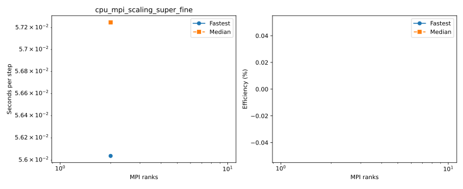

# Full benchmark suite

LatitudeLongitudeGrid without bathymetry; Float64, WENOVectorInvariantDefault, WENO7, CATKE, T/S, SplitRungeKutta3.
Δt=60 s; 30 requested free-surface substeps; two untimed steps and five ten-step windows.
One MPI rank per CPU core or GPU, one Julia computation thread per rank. CPU extended halos=false; GPU=true.
Window boundaries synchronize MPI ranks and GPUs. Fastest/median statistics use the maximum across ranks.
Efficiency uses the measured one-rank baseline for each scaling series. Missing baselines have no efficiency estimate.
Profiled timings are separate; Nsight captures CUDA/NVTX/MPI after warmup. Kernel shares sum durations across ranks, not elapsed wall time.

## cpu_mpi_scaling_super_fine

Highest completed count: **2 ranks**.

| Case | Ranks | Partition | Global resolution | Grid type | State | Fastest s/step | Median s/step | Efficiency fastest / median | Details |
|---|---:|---|---|---|---|---:|---:|---|---|
| smoke_validation | 2 | 2x1x1 | 72x36x8 | LatitudeLongitudeGrid | COMPLETED | 0.056037 | 0.057248 | — | Rank results, finite fields and resource placement verified |

[smoke_validation configuration](configuration.md): local resolution **36–36 × 36–36 × 8**, retained free-surface substeps [21].
